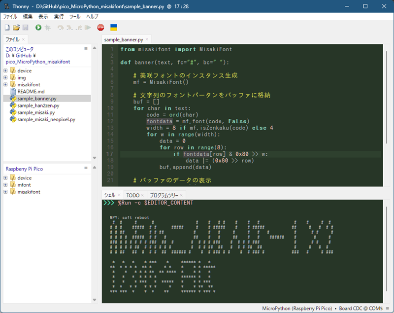
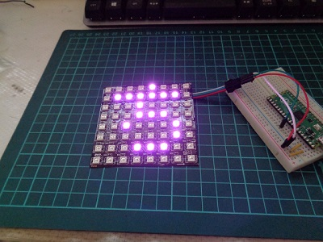

# pico_MicroPython_misakifont

Raspberry Pi Pico MicroPython用美咲フォントライブラリ  

## 更新情報

2024/03/13 更新 v1.1  
・美咲フォントの最新版 2021-05-05(美咲ゴシック第2)利用に変更
　(以前は2012-06-03 正式公開初版を利用)  
・isZenkaku()の追加、
　⇒ 半角(4ドット)・全角(8ドット)幅判定により半角文字を詰めて表示可能となりました  
・いくつかのバグ対応(半角・全角変換ミスなど)  

## 概要

Raspberry Pi Pico MicroPython用の美咲フォントライブラリです。  
Raspberry Pi Pico MicroPython用ですが、他の環境でも利用可能です。  
フラッシュメモリ消費を抑えるため、フォントを  
　教育漢字1,006字(小学校で習う漢字）＋ひらがな・カタカナ・記号・半角等の1,710字  
に絞っています。  

※ 美咲フォントは、Little Limitさんが開発し、配布しているフォントです。  
　 8×8 ドット日本語フォント「美咲フォント」   <http://littlelimit.net/misaki.htm>  
　 本ライブラリでは、misaki_bdf_2021-05-05.zip 美咲ゴシック第2 を利用しています。

### 収録文字  

````収録文字
!"#$%&'()*+,-./0123456789:;<=>?@ABCDEFGHIJKLMNOPQRSTUVWXYZ[\]^_`abcdefghi
jklmnopqrstuvwxyz{|}¢£¥§¨¬°±´¶×÷ΑΒΓΔΕΖΗΘΙΚΛΜΝΞΟΠΡΣΤΥΦΧΨΩαβγδεζηθικλμνξοπρ
στυφχψωЁАБВГДЕЖЗИЙКЛМНОПРСТУФХЦЧШЩЪЫЬЭЮЯабвгдежзийклмнопрстуфхцчшщъыьэюяё
‐―‖‘’“”†‡‥…′″※‾℃№℡ÅⅠⅡⅢⅣⅤⅥⅦⅧⅨⅩ←↑→↓⇒⇔∀∂∃∇∈∋∑−√∝∞∟∠∧∨∩∪
∫∬∮∴∵∽≒≠≡≦≧≪≫⊂⊃⊆⊇⊥⊥⊿⌒①②③④⑤⑥⑦⑧⑨⑩⑪⑫⑬⑭⑮⑯⑰⑱⑲⑳■□▲△▼▽◆◇○◎●◯
★☆♀♂♪♭♯　、。〃々〆〇〈〉《》「」『』【】〒〓〔〕〜〝〟ぁあぃいぅうぇえぉおか
がきぎくぐけげこごさざしじすずせぜそぞただちぢっつづてでとどなにぬねのはばぱひび
ぴふぶぷへべぺほぼぽまみむめもゃやゅゆょよらりるれろゎわゐゑをん゛゜ゝゞァアィイ
ゥウェエォオカガキギクグケゲコゴサザシジスズセゼソゾタダチヂッツヅテデトドナニヌ
ネノハバパヒビピフブプヘベペホボポマミムメモャヤュユョヨラリルレロヮワヰヱヲンヴ
ヵヶ・ーヽヾ㈱㈲㈹㊤㊥㊦㊧㊨㎎㎏㎜㎝㎞㎡㏄㏍一丁七万三上下不世両並中丸主久乗九乱
乳予争事二五亡交京人仁今仏仕他付代令以仮仲件任休会伝似位低住体何余作使例供価便係
保信修俳俵倉個倍候借値停健側備傷働像億優元兄兆先光児党入全八公六共兵具典内円冊再
写冬冷処出刀分切刊列初判別利制刷券刻則前副割創劇力功加助努労効勇勉動務勝勢勤包化
北区医十千午半卒協南単博印危卵厚原厳去参友反収取受口古句可台史右号司各合同名后向
君否吸告周味呼命和品員唱商問善喜営器四回因団困囲図固国園土圧在地坂均垂型城域基埼
堂報場塩境墓増士声売変夏夕外多夜夢大天太夫央失奏奮女好妹妻姉始委姿婦子字存孝季学
孫宅宇守安完宗官宙定宝実客宣室宮害家容宿寄密富寒察寸寺対専射将尊導小少就尺局居届
屋展属層山岩岸島川州巣工左差己巻市布希師席帯帰帳常幕干平年幸幹幼庁広序底店府度座
庫庭康延建弁式弓引弟弱張強当形役往径待律後徒従得復徳心必志忘応忠快念思急性恩息悪
悲情想意愛感態慣憲成我戦戸所手才打批承技投折担招拝拡拾持指挙捨授採探接推提揮損操
支改放政故救敗教散敬数整敵文料断新方旅族旗日旧早明易昔星映春昨昭昼時晩景晴暑暖暗
暮暴曜曲書最月有服朗望朝期木未末本札机材村束条来東松板林枚果枝染柱査栄校株根格案
桜梅械棒森植検業極楽構様標模権横樹橋機欠次欲歌止正武歩歯歴死残段殺母毎毒比毛氏民
気水氷永求池決汽河油治沿泉法波泣注泳洋洗活派流浅浴海消液深混清済減温測港湖湯満源
準漁演漢潔潮激火灯灰災炭点無然焼照熟熱燃父片版牛牧物特犬犯状独率玉王班現球理生産
用田由申男町画界畑留略番異疑病痛発登白百的皇皮皿益盛盟目直相省看県真眼着矢知短石
砂研破確磁示礼社祖祝神票祭禁福私秋科秒秘移程税種穀積穴究空窓立章童競竹笑笛第筆等
筋答策算管箱節築簡米粉精糖糸系紀約紅納純紙級素細終組経結給統絵絶絹続綿総緑線編練
縦縮績織罪置署羊美群義羽翌習老考者耕耳聖聞職肉肥育肺胃背胸能脈脳腸腹臓臣臨自至興
舌舎航船良色花芸芽若苦英茶草荷菜落葉著蒸蔵薬虫蚕血衆行術街衛衣表裁装裏補製複西要
見規視覚覧親観角解言計討訓記訪設許訳証評詞試詩話誌認誕語誠誤説読課調談論諸講謝識
警議護谷豆豊象貝負財貧貨責貯貴買貸費貿賀賃資賛賞質赤走起足路身車軍転軽輪輸辞農辺
近返述迷追退送逆通速造連週進遊運過道達遠適選遺郡部郵郷都配酒酸里重野量金針鉄鉱銀
銅銭鋼録鏡長門閉開間関閣防降限陛院除陸険陽隊階際障集雑難雨雪雲電青静非面革音頂順
預領頭題額顔願類風飛食飯飲飼養館首馬駅験骨高魚鳥鳴麦黄黒鼻！＃＄％＆（）＊＋，．
／０１２３４５６７８９：；＜＝＞？＠ＡＢＣＤＥＦＧＨＩＪＫＬＭＮＯＰＱＲＳＴＵＶ
ＷＸＹＺ［］＾＿｀ａｂｃｄｅｆｇｈｉｊｋｌｍｎｏｐｑｒｓｔｕｖｗｘｙｚ｛｜｝｡｢｣､
･ｦｧｨｩｪｫｬｭｮｯｰｱｲｳｴｵｶｷｸｹｺｻｼｽｾｿﾀﾁﾂﾃﾄﾅﾆﾇﾈﾉﾊﾋﾌﾍﾎﾏﾐﾑﾒﾓﾔﾕﾖﾗﾘﾙﾚﾛﾜﾝﾞﾟ￣￥
````

## 仕様

* 文字コード  UTF16  
* フォントサイズ  8x8ドッド（美咲フォント)  
* フォント格納形式  


* 利用可能フォント数  1,770字  
  * 漢字 教育漢字 1,006字(小学校で習う漢字)  
  * 非漢字 全角 546字(全角英数字、ひらがな、かたかな、記号)  
  * 半角フォント  158字(半角記号、半角英数、半角カタカナ）  

## 配布ファイル

配布するファイル構成は以下の通りです。  

````tree
./
│  README.md                  [このドキュメント]
│  sample_misaki.py           [サンプル1(コンソール上にフォントデータを表示)]
│  sample_banner.py           [サンプル2(コンソール上にバナー表示)]
│  sample_misaki_neopixel.py  [サンプル3(NeoPixcel利用モジュール)]
│  sample_han2zen.py          [サンプル4(半角全角変換テスト)]
├─ device/
│      neomatrix.py           [サンプル3用 NeoPixcel利用モジュール]
├─ img/                       [このドキュメントの画像ファイル]
└─ misakifont/                [美咲フォントパッケージ]
        misakifont.py         [美咲フォントクラスモジュール]
        misakifontdata.py     [美咲フォントデータ]
        tma_jp_utl.py         [サブルーチン]
        __init__.py
````

## インストールおよびモジュールのインポート

* ディレクトリmisakifontをRaspberry Pi Picoのフラッシュメモリに配置します。
* ライブラリをインポートします。  
from misakifont import MisakiFont

## ライブラリ

### MisakiFontクラス  

MisakiFontは指定した文字コード（UTF16)に対応するフォントデータを取得するためのクラスです。

#### コンストラクタ

【書式】  
class MisakiFont()  

【説明】
インスタンスを生成します。  

【利用例】  
mf=MisakiFont()

#### メソッド  

##### font(ucode, flgz=True)

フォントデータの取得  

【引数】  
ucode：文字コード
flgz: 半角⇒全角変換指定（True:全角変換する、False:全角変換しない）  

【戻り値】  
フォントデータ8バイト  
該当フォントがない場合は、豆腐("□")のフォントデータを返す

【説明】  
引数ucodeで指定した文字コードに対応するフォントデータを8バイトをタプル形式で返します。  
指定したコードに対応するフォントデータがない場合は、豆腐("□")を返します。

【利用例】  
mf=MisakiFont()  
d = mf.font(ord("あ"))

##### isHkana(ucode)

半角カタカナ判定  

【引数】  
ucode：文字コード

【戻り値】  
True：指定した文字コードは半角カタカナである  
False：指定した文字は半角カタカナではない

【説明】  
指定した文字コードが半角カタカナであるか判定します。

##### isZenkaku(ucode)

全角判定  

【引数】  
ucode：文字コード

【戻り値】  
True：指定した文字コードが全角幅フォントである
False：指定した文字コードが半角幅フォントである

【説明】  
指定した文字コードが全角幅(8ドット)か半角幅(4ドット)かを判定します。  

##### hkana2kana(ucode)

半角カタカナ⇒全角カタカナ変換  

【引数】  
ucode：文字コード

【戻り値】  
変換した文字コードを返す

【説明】  
指定した文字コードが半角カタカナの場合、対応する全角カタカナ文字コードを返します。  
半角カタカナでない場合は、そのまま返します。  

##### han2zen(ucode)

半角⇒全角変換  

【引数】  
ucode：文字コード

【戻り値】  
変換した文字コードを返す

【説明】  
指定した文字コードが半角文字(記号、英数字、カタカナ)の場合、対応する全角文字コードを返します。  
半角文字でない場合は、そのまま返します。  

##### find(ucode)

文字コードの検索  

【引数】  
ucode：文字コード

【戻り値】  
0以上：該当するフォントデータが存在する(値はフォントデータのインデックス番号)  
-1：該当するフォントデータが存在しない

【説明】  
文字コードに対応するフォントデータが存在するかをチェックします。  
フォントデータが存在しない場合は、-1を返します。

## ライブラリ利用例①

コンソール（標準出力）に１文字ずつフォントパータンを表示します。  

````sample_misaki.py
from misakifont import MisakiFont

"""
 フォントのビットマップ表示
"""
def show_bitmap(fd):
    for row in range(0,7):
        for col in range(0,7):
            print("#" if (0x80>>col) & fd[row] else " ", end="")
        print()


str="こんにちは世界！"
mf = MisakiFont()
for c in str:
    d = mf.font(ord(c))
    show_bitmap(d)
    print()
````

実行結果  
  

## ライブラリ利用例②

コンソールに横表示で指定して文字列をバナー表示します。  

````sample_banner.py
from misakifont import MisakiFont

def banner(text, fc="#", bc=" "):

    # 美咲フォントのインスタンス生成
    mf = MisakiFont()
  
    # 文字列のフォントパータンをバッファに格納
    buf = []
    for char in text:
        code = ord(char)
        fontdata = mf.font(code, False)
        width = 8 if mf.isZenkaku(code) else 4
        for w in range(width):
            data = 0        
            for row in range(8):
                if fontdata[row] & 0x80 >> w:
                    data |= (0x80 >> row)
            buf.append(data)

    # バッファのデータの表示
    for row in range(8):
        for i in range(len(buf)):
            print(fc if buf[i] & (0x80>>row) else bc, end='')
        print()

banner("AbあAaこんばんはー１×2")
banner("12345今日は", "*")
````

実行結果  
  

## ライブラリ利用例③

NeoPixcel 8x8ドットマトリックスに文字を表示するサンプルプログラムです。  
Raspberry Pi Pico 専用です。他のデバイスでは動作しません。  
ドットマトリックスを制御用に配布ファイルのdeviceディレクトリをフラッシュメモリ上に配置して下さい。  
NeoPixcelのデータ送信にはGP26ピンを使用しています。適宜変更してご利用下さい。  

````sample_misaki_neopixel.py
"""
"""
Neopixel 8x8ドットマトリックス 美咲フォント表示デモ

"""
from time import sleep_ms
from random import randint
from misakifont import MisakiFont
from device.neomatrix import NeoMatrix

pin = 26
maxBright = 15

str="12abcこんにちは,世界! ｺﾝﾆﾁﾊｾｶｲ!"
np = NeoMatrix(pin)
mf = MisakiFont()
np.cls()

while True:
    #矩形の表示
    for i in range(5):
        color = [randint(0, maxBright) for n in range(3)]
        for j in range(0, 4):
            np.cls(False)
            np.line(j, j, 7-j, 7-j, color, 1)
            sleep_ms(150)

    #文字のスクロール表示
    for c in str:
        d = mf.font(ord(c),False)
        color = [randint(0, maxBright) for n in range(3)]
        np.scrollIn(d, color,100, fw = 8 if mf.isZenkaku(ord(c)) else 4)
    sleep_ms(1000)
    np.cls()
````

実行結果  
  
