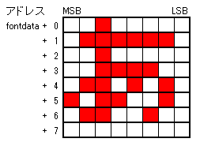
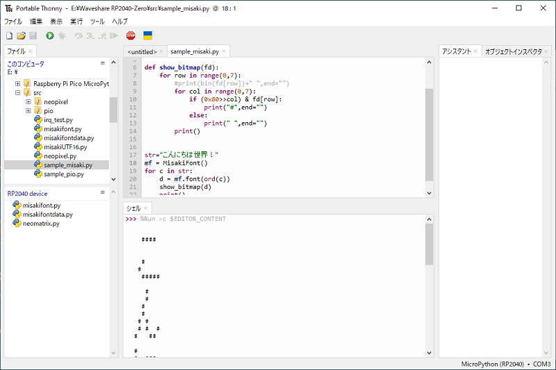
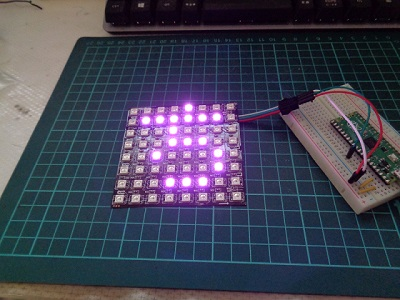

# pico_MicroPython_misakifont

Raspberry Pi Pico MicroPython用美咲フォントライブラリ

## 概要

Raspberry Pi Pico MicroPython用の美咲フォントライブラリです。  
フラッシュメモリ消費を抑えるため、フォントを  
教育漢字1,006字(小学校で習う漢字）＋ひらがな・カタカナ・記号・半角等の1,710字に絞っています。  

※ 美咲フォントは、Little Limitさんが開発し、配布しているフォントです。  
   8×8 ドット日本語フォント「美咲フォント」  
   <http://littlelimit.net/misaki.htm>

収録文字  


## 仕様

* 文字コード  UTF16  
* フォントサイズ  8x8ドッド（美咲フォント)  
* フォント格納形式  


* 利用可能フォント数  1,710字  
  * 漢字 教育漢字 1,006字(小学校で習う漢字）  
  * 非漢字 全角 546字(全角英数字、ひらがな、かたかな、記号)  
  * 半角フォント  158字(半角記号、半角英数、半角カタカナ）  

## 配布ファイル

配布するファイル構成は以下の通りです。  

````tree
./
│  README.md                  [このドキュメント]
│  sample_han2zen.py          [サンプル3 （半角全角変換テスト）]
│  sample_misaki.py           [サンプル1（コンソール上にフォントデータを表示）]
│  sample_misaki_neopixel.py  [サンプル2用 NeoPixcel利用モジュール]
├─ device/
│      neomatrix.py           [サンプル2用 NeoPixcel利用モジュール]
├─ img/                       [このドキュメントの画像ファイル]
└─ misakifont/                [美咲フォントパッケージ]
        misakifont.py         [美咲フォントクラスモジュール]
        misakifontdata.py     [美咲フォントデータ]
        tma_jp_utl.py         [サブルーチン]
        __init__.py
````

## インストールおよびモジュールのインポート

* ディレクトリmisakifontをRaspberry Pi Picoのフラッシュメモリに配置します。
* ライブラリをインポートします。  
from misakifont import MisakiFont

## ライブラリ

### MisakiFontクラス  

MisakiFontは指定した文字コード（UTF16)に対応するフォントデータを取得するためのクラスです。

#### コンストラクタ

【書式】  
class MisakiFont()  

【説明】
インスタンスを生成します。  

【利用例】  
mf=MisakiFont()

#### メソッド  

##### font(ucode, flgz=True)

フォントデータの取得  

【引数】  
ucode：文字コード
flgz: 半角⇒全角変換指定（True:全角変換する、False:全角変換しない）  

【戻り値】  
フォントデータ8バイト  
該当フォントがない場合は、豆腐("□")のフォントデータを返す

【説明】  
引数ucodeで指定した文字コードに対応するフォントデータを8バイトをタプル形式で返します。  
指定したコードに対応するフォントデータがない場合は、豆腐("□")を返します。

【利用例】  
mf=MisakiFont()
d = mf.font(ord("あ"))

##### isHkana(ucode)

半角カタカナ判定  

【引数】  
ucode：文字コード

【戻り値】  
True：指定した文字コードは半角カタカナである  
False：指定した文字は半角カタカナではない

【説明】  
指定した文字コードが半角カタカナであるか判定します。

##### hkana2kana(ucode)

半角カタカナ⇒全角カタカナ変換  

【引数】  
ucode：文字コード

【戻り値】  
変換した文字コードを返す

【説明】  
指定した文字コードが半角カタカナの場合、対応する全角カタカナ文字コードを返します。  
半角カタカナでない場合は、そのまま返します。  

##### han2zen(ucode)

半角⇒全角変換  

【引数】  
ucode：文字コード

【戻り値】  
変換した文字コードを返す

【説明】  
指定した文字コードが半角文字(記号、英数字、カタカナ）の場合、対応する全角文字コードを返します。  
半角文字でない場合は、そのまま返します。  

##### find(ucode)

文字コードの検索  

【引数】  
ucode：文字コード

【戻り値】  
0以上：該当するフォントデータが存在する(値はフォントデータのインデックス番号)  
-1：該当するフォントデータが存在しない

【説明】  
文字コードに対応するフォントデータが存在するかをチェックします。  
フォントデータが存在しない場合は、-1を返します。

## ライブラリ利用例①

````sample_misaki.py
from misakifont import MisakiFont

"""
 フォントのビットマップ表示
"""
def show_bitmap(fd):
    for row in range(0,7):
        for col in range(0,7):
            print("#" if (0x80>>col) & fd[row] else " ", end="")
        print()


str="こんにちは世界！"
mf = MisakiFont()
for c in str:
    d = mf.font(ord(c))
    show_bitmap(d)
    print()
````

実行結果  
  

## ライブラリ利用例②

NeoPixcel 8x8ドットマトリックスに文字を表示するサンプルプログラムです。  
ドットマトリックスを制御用に配布ファイルのdeviceディレクトリをフラッシュメモリ上に配置して下さい。  
NeoPixcelのデータ送信にはGP26ピンを使用しています。適宜変更してご利用下さい。  

````sample_misaki_neopixel.py
"""
Neopixel 8x8ドットマトリックス 美咲フォント表示デモ

"""
from time import sleep_ms
from random import randint
from misakifont import MisakiFont
from device.neomatrix import NeoMatrix

pin = 26
maxBright = 20

str="こんにちは世界！"
np = NeoMatrix(pin)
mf = MisakiFont()
np.cls()

while True:
    #矩形の表示
    for i in range(5):
        color = [randint(0, maxBright) for n in range(3)]
        for j in range(0, 4):
            np.cls(False)
            np.line(j, j, 7-j, 7-j, color, 1)
            sleep_ms(150)

    #文字のスクロール表示
    for c in str:
        d = mf.font(ord(c))
        color = [randint(0, maxBright) for n in range(3)]
        np.scrollIn(d, color,100)
    sleep_ms(1000)
    np.cls()
````

実行結果  
  
